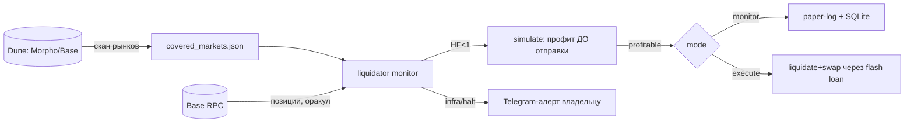

# Архитектура liquidator

## Обзор и принцип изоляции

Liquidator — отдельный бот и отдельный процесс, намеренно **не** встроенный в
twidgest/essayist. Изоляция на трёх уровнях:
- **Код**: свой репозиторий (`kelbic/liquidator`), клон (`/root/_clone_liq`), папка
  (`/root/liquidator`), своя SQLite (`liquidator.db`).
- **Процесс**: свой systemd-сервис `liquidator-bot`. Crash-loop тут не трогает twidgest.
- **Ресурс**: cgroup-капы в `liquidator-bot.service` (`CPUWeight=30` — уступает
  twidgest при контеншене; `MemoryMax=512M` — жёсткий потолок; OOM убьёт только этот
  сервис). Всплеск здесь физически не может starve'ить продакшен.



## Фазы

- **Фаза 1 — monitor / paper-trade.** Следит за покрываемыми рынками, ловит HF<1,
  симулирует профит, **логирует, что сделал бы** — без транзакций. Не латентно-
  критична → ресурсный кап не мешает, денег под риском нет. Цель: сверить живой поток
  возможностей с моделью (реальны ли частота/размер/конкуренция из Dune-скана).
- **Фаза 2 — execute.** Реальная отправка. Латентность важна, но хвост её прощает
  (тонкая конкуренция). Гейты: симуляция-перед-отправкой, kill switch, тестнет первым.

## Модули

- **`main.py`** — entry: загрузка конфига, цикл watcher'а, проводка модулей. Сейчас
  крутится вхолостую (Фаза 1 не реализована) — можно поднять сервис и проверить капы.
- **`config.py`** — env-конфиг (импорт-безопасный, `Config.from_env`).
- **`chain/rpc.py`** — Base RPC (web3 ленивым импортом; wss под подписку на блоки).
- **`chain/morpho.py`** — чтение рынков/позиций Morpho Blue, расчёт HF. Только чтение.
- **`chain/simulate.py`** — симуляция ликвидации ДО отправки (eth_call/форк) — гейт
  профита. On-chain аналог dry-run.
- **`strategy/scanner.py`** — какие рынки покрываем (из Dune-скана → JSON).
- **`strategy/pnl.py`** — математика чистого профита (зеркалит `analysis/liq_model.py`)
  + формула LIF Morpho (`min(1.15, 1/(1-0.3*(1-LLTV)))`).
- **`strategy/guard.py`** — kill switch (лимиты дневного убытка/газа, inflight).
- **`store.py`** — своя SQLite: `positions`, `simulations`, `actions` (аудит).
- **`alerts.py`** — Telegram-алерт админу с антифлудом (паттерн essayist `infra_error`).
- **`analysis/`** — оффлайн-инструменты: модель, мост Dune, SQL-скан.

## PnL-математика

На выигранной ликвидации (всё в USD):
```
net = D*bonus − D*(1+bonus)*slippage − gas − tip − D*fl_fee
```
`D` — погашенный долг; `bonus = LIF−1`; `tip` — priority fee секвенсеру Base
(«взятка»); `fl_fee = 0` (встроенный flash loan Morpho). `bonus` точный из LLTV —
не оценка. Одна формула в `strategy/pnl.py` и `analysis/liq_model.py`, чтобы paper и
модель сходились.

## Механизмы безопасности

- **Flash-loan zero-funds** — контракт-ликвидатор не держит стоящих средств (гасит
  долг занятым в той же транзакции, отдаёт в конце). Кошелёк = только газ-ETH →
  honeypot минимален. Контраст: Jared слили $15M через approve фейковым контрактам.
- **Симуляция-перед-отправкой** — реверт или net < `MIN_PROFIT_USD` → не отправляем.
- **Kill switch** — пробой дневного лимита убытка/газа → стоп + алерт.
- **Ключ только на VPS** — `WALLET_KEY` в `.env` (chmod 600), не в коде, не у ассистента.
- **systemd анти-крашлуп** — `StartLimitBurst=5` (урок essayist).

## Конкуренция на Base

Ордеринг — аукцион priority fee в 200мс-флэшблоках (base-builder). Приватного бандл-
канала нет: конкуренция в публичном мемпуле через tip секвенсеру + латентность. В
модели это `bribe_frac` = tip как доля бонуса; меряется из данных транзакции
(`tip_per_gas × gas_used`).

## Что трогать не нужно

1. **Flash-loan-модель / отсутствие стоящих средств в контракте** — ломать нельзя
   (капитал + honeypot).
2. **Симуляция-перед-отправкой как гейт** — не обходить даже для «мелкой» правки.
3. **Ресурсные капы в unit-файле** — не снимать без явного решения (риск задеть twidgest).
4. **`WALLET_KEY`, `.env`, `*.db`, `venv/`** — никогда не коммитить (защищено `.gitignore`).
5. **`store.SCHEMA`** — изменения требуют миграции (Alembic нет, `ALTER TABLE` руками).

## Известные ограничения

- `win_prob` в модели — эвристика; точная требует слоя time-to-liquidation (история
  оракула).
- Edge хвоста сжимается по мере внедрения OEV-recapture (SVR/pre-liquidations).
- Имена декодированных таблиц Dune и адрес синглтона Morpho на Base — сверить с фактом
  перед Фазой 1.
